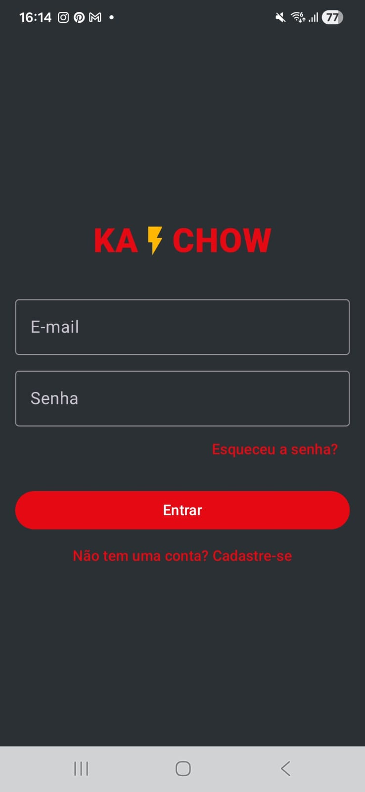
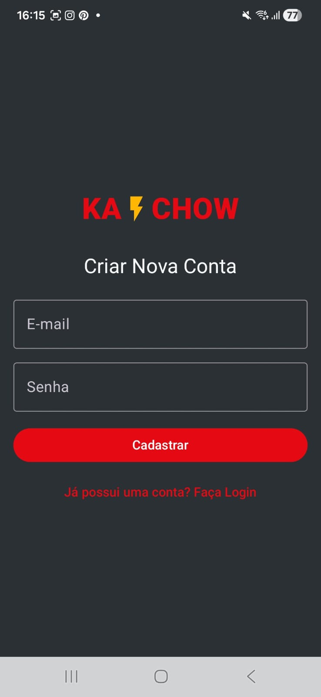
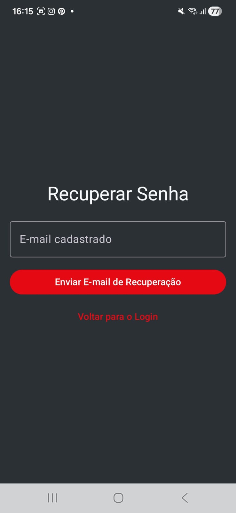
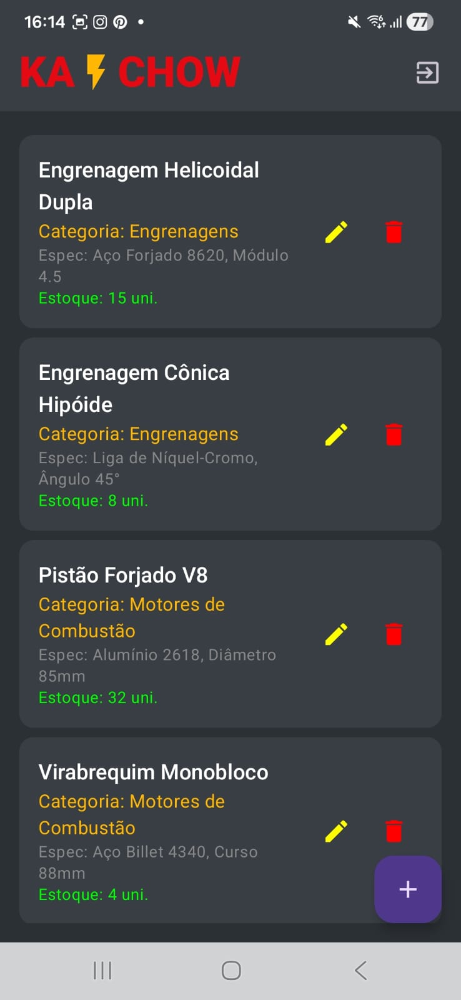
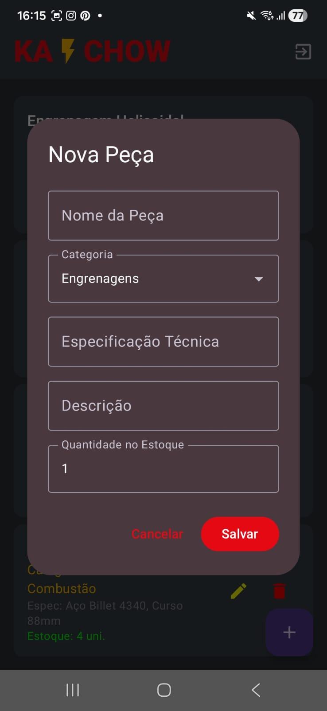
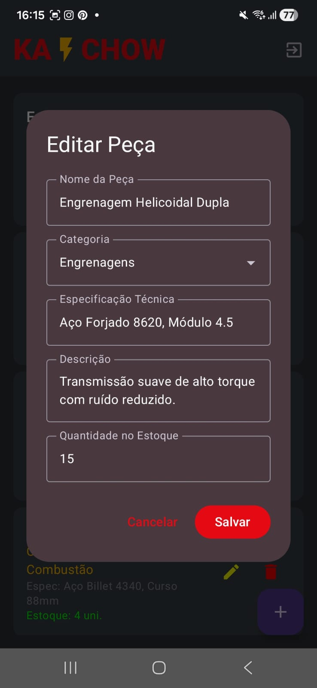

# **Anatomia Mecânica**

Um catálogo interativo de peças automotivas e industriais inspirado no universo de Relâmpago McQueen (Ka-Chow!).

---

### **Sobre o Projeto**

O Anatomia Mecânica é um aplicativo Android desenvolvido em Kotlin e Jetpack Compose com foco em gerenciamento de peças mecânicas e componentes industriais complexos.

O app combina um fluxo seguro de autenticação através do Firebase Authentication com um sistema dinâmico de CRUD mantido em memória local via StateFlow. Tudo isso com uma identidade visual temática baseada na estética do Relâmpago McQueen.

---

### **Screenshots**

<p align="center">
  
  
  
</p>
<p align="center">
  <sub><b>Login:</b> Acesso seguro com e-mail e senha cadastrados.</sub><br>
  <sub><b>Cadastro:</b> Criação de nova conta de usuário no sistema.</sub><br>
  <sub><b>Recuperar Senha:</b> Envio de e-mail de redefinição de senha via Firebase.</sub>
</p>

<br>

<p align="center">
  
  
  
</p>
<p align="center">
  <sub><b>Tela Inicial:</b> Exibição e filtragem do catálogo de peças automotivas e industriais.</sub><br>
  <sub><b>Criar Peça:</b> Formulário customizado para adicionar um novo componente ao catálogo.</sub><br>
  <sub><b>Editar Peça:</b> Atualização dos detalhes e informações de uma peça existente.</sub>
</p>

### **Funcionalidades**

• Cadastro de usuário (createUserWithEmailAndPassword)  
• Login (signInWithEmailAndPassword)  
• Recuperação de senha por e-mail (sendPasswordResetEmail)  
• Logout  
• Home com identidade visual de Relâmpago McQueen e atalhos por categoria  
• Filtro de peças por categoria (Engrenagens, Motores, Turbinas e Peças Industriais)  
• Cadastro e edição de peças via dialog customizado  
• Exclusão de peças em tempo real  
• Restauração de catálogo com peças padrão do tema  
• Perfil com dados do usuário autenticado e sair

---

### **Tecnologias Utilizadas**

• Linguagem: Kotlin  
• UI Toolkit: Jetpack Compose  
• Navegação: Navigation Compose  
• Arquitetura: MVVM (Model-View-ViewModel)  
• Gerenciamento de Estado: StateFlow (MutableStateFlow / collectAsState)  
• Autenticação: Firebase Authentication

---

### **Como Executar o Projeto**

**Pré-requisitos**

• Android Studio instalado (versão Giraffe ou superior)  
• JDK 17 ou superior configurado  
• Dispositivo Android físico ou emulador (API 24+)

**Passo a Passo**

1. Clone o repositório:
   ```bash
   git clone [https://github.com/hanjimeu/KaChow](https://github.com/hanjimeu/KaChow)
Abra o projeto:

Abra o Android Studio, selecione Open e escolha a pasta do projeto clonado.

Configure o Firebase:

Acesse o Console do Firebase.

Crie um projeto e adicione um app Android com o pacote com.example.anatomiamecanica.

Baixe o arquivo google-services.json e adicione na pasta app/ do seu projeto.

No Firebase, ative o provedor de autenticação por E-mail/Senha.

Execute o aplicativo:

Sincronize o Gradle (Sync Project with Gradle Files).

Execute o app no emulador ou dispositivo físico (Shift + F10).

Autor

Desenvolvido por Mariana dos Santos Moreira.

---

### **Funcionalidades**

• Cadastro de usuário (createUserWithEmailAndPassword)  
• Login (signInWithEmailAndPassword)  
• Recuperação de senha por e-mail (sendPasswordResetEmail)  
• Logout  
• Home com identidade visual de Relâmpago McQueen e atalhos por categoria  
• Filtro de peças por categoria (Engrenagens, Motores, Turbinas e Peças Industriais)  
• Cadastro e edição de peças via dialog customizado  
• Exclusão de peças em tempo real  
• Restauração de catálogo com peças padrão do tema  
• Perfil com dados do usuário autenticado e sair

---

### **Tecnologias Utilizadas**

• Linguagem: Kotlin  
• UI Toolkit: Jetpack Compose  
• Navegação: Navigation Compose  
• Arquitetura: MVVM (Model-View-ViewModel)  
• Gerenciamento de Estado: StateFlow (MutableStateFlow / collectAsState)  
• Autenticação: Firebase Authentication

---

### **Como Executar o Projeto**

**Pré-requisitos**

• Android Studio instalado (versão Giraffe ou superior)  
• JDK 17 ou superior configurado  
• Dispositivo Android físico ou emulador (API 24+)

**Passo a Passo**

1. Clone o repositório:
   ```bash
   git clone [https://github.com/hanjimeu/KaChow](https://github.com/hanjimeu/KaChow)
Abra o projeto:

Abra o Android Studio, selecione Open e escolha a pasta do projeto clonado.

Configure o Firebase:

Acesse o Console do Firebase.

Crie um projeto e adicione um app Android com o pacote com.example.anatomiamecanica.

Baixe o arquivo google-services.json e adicione na pasta app/ do seu projeto.

No Firebase, ative o provedor de autenticação por E-mail/Senha.

Execute o aplicativo:

Sincronize o Gradle (Sync Project with Gradle Files).

Execute o app no emulador ou dispositivo físico (Shift + F10).

Autor

Desenvolvido por Mariana dos Santos Moreira.